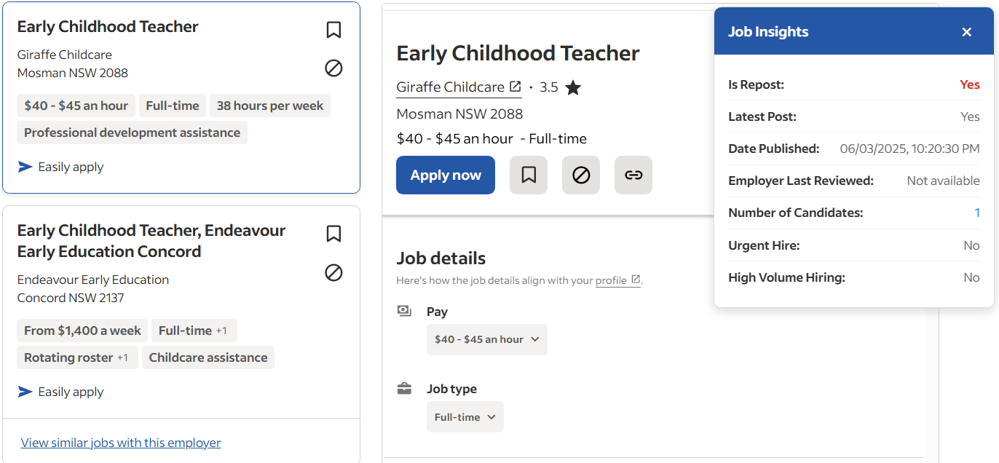

# Indeed Job Insights

A browser extension that reveals hidden job information on Indeed job listings, helping you make better application decisions.

## 🔍 What It Shows

- **Is Repost**: Whether the job has been posted before
- **Latest Post**: If this is the most recent posting
- **Date Published**: Exact timestamp when the job was posted
- **Employer Last Reviewed**: When the employer was last active
- **Number of Candidates**: How many people have applied
- **Urgent Hire**: If the employer is urgently hiring
- **High Volume Hiring**: If they're hiring multiple candidates

## 📸 Screenshot


*The insights panel appears on job detail pages*

## 🚀 Installation

### Chrome/Edge (Manual Installation)

1. **Download the Extension**
   - Clone this repository or download as ZIP
   - Extract the files to a folder

2. **Enable Developer Mode**
   - Open Chrome/Edge and go to `chrome://extensions/` (or `edge://extensions/`)
   - Toggle on "Developer mode" in the top right

3. **Load the Extension**
   - Click "Load unpacked"
   - Select the folder containing the extension files
   - The extension should now appear in your extensions list

### Firefox (Manual Installation)

1. **Download the Extension**
   - Clone this repository or download as ZIP
   - Extract the files to a folder

2. **Load Temporary Add-on**
   - Open Firefox and go to `about:debugging`
   - Click "This Firefox"
   - Click "Load Temporary Add-on"
   - Select the `manifest.json` file from the extension folder

## 📖 How to Use

1. **Navigate to Indeed**
   - Go to [indeed.com](https://indeed.com)
   - Search for jobs as usual

2. **Open a Job Listing**
   - Click on any job card to view the job details
   - The insights panel will automatically appear in the top-right corner

3. **View the Insights**
   - The panel shows all available job data
   - Red values indicate potential concerns (reposts, urgent hiring)
   - Green values indicate positive signals
   - Blue values are informational

4. **Browse Multiple Jobs**
   - Click different job cards to see insights for each
   - The extension automatically refreshes data for each new job
   - The panel updates with job-specific information

## 🎯 Key Features

- **Automatic Detection**: Works on all Indeed job detail pages
- **Real-time Updates**: Refreshes data when switching between jobs
- **Clean Interface**: Non-intrusive panel that doesn't interfere with Indeed's layout
- **Detailed Information**: Shows data not normally visible to job seekers
- **Easy to Close**: Click the × button to hide the panel

## 🛠️ Troubleshooting

### Panel Not Appearing
- Make sure you're on a job detail page (URL contains `/viewjob`)
- Try refreshing the page
- Check that the extension is enabled in your browser

### Showing "Unable to extract job data"
- This job might not have the required data structure
- Try refreshing the page
- Some jobs may not have all insight data available

### Data Seems Incorrect
- The extension extracts data directly from Indeed's internal systems
- If data appears wrong, try refreshing the page
- Some older job posts may have limited data

## 🔧 Technical Details

### Files Structure
```
indeed-job-insights/
├── manifest.json          # Extension configuration
├── content.js            # Main extension logic
├── styles.css           # Panel styling
├── icon16.png          # Extension icon (16x16)
├── icon48.png          # Extension icon (48x48)
├── icon128.png         # Extension icon (128x128)
└── README.md           # This file
```

### How It Works
1. The extension monitors Indeed job detail pages
2. Extracts data from Indeed's internal `window._initialData` object
3. Parses job information and hiring insights
4. Displays the information in a floating panel
5. Automatically refreshes data when navigating between jobs

### Permissions Used
- `activeTab`: Access to the current Indeed tab
- `https://indeed.com/*`: Permission to run on Indeed pages

## 🤝 Contributing

Contributions are welcome! Please feel free to submit issues or pull requests.

### Development Setup
1. Clone the repository
2. Make your changes to the relevant files
3. Test by loading the extension in developer mode
4. Submit a pull request with your improvements

### Reporting Issues
If you encounter any problems:
1. Check the browser console for error messages
2. Note which Indeed page you were on
3. Include your browser version and OS
4. Open an issue with detailed information

## 📄 License

This project is licensed under the MIT License - see the [LICENSE](LICENSE) file for details.

## ⚠️ Disclaimer

This extension is not affiliated with Indeed. It extracts publicly available data that Indeed already loads in your browser. Use responsibly and in accordance with Indeed's terms of service.

## 🔄 Version History

### v1.0.0
- Initial release
- Basic job insights extraction
- Automatic panel display
- Support for Chrome, Firefox, and Edge

---

**Made with ❤️ for job seekers**

*If this extension helped you in your job search, consider giving it a ⭐ on GitHub!*
